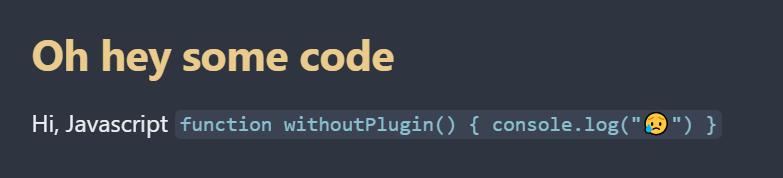
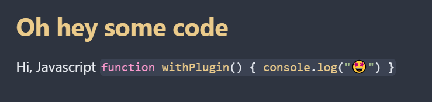

# Obsidian Inline Syntax Highlight

This [Obsidian](https://obsidian.md) plugin adds syntax highlighting to inline code blocks! It works in reading view and doesn't alter the file content at all.

Go from 🥱

to 💅

## Installation

### Manual

1. Clone this repo into your `<vault>/.obsidian/plugins` directory
2. In `plugins/obisidian-inline-syntax-hl`: `npm install && npm run build`
3. Enable the plugin: `preferences → Community plugins → toggle slider for "Inline Syntax Highlight"`
4. (Optional) set your preferred languages in the settings

### Through community plugins

Not yet!

## How it works

- The plugin uses [highlight.js](https://highlightjs.readthedocs.io/en/latest/supported-languages.html) to determine a language for each inline codeblock
- In the plugin settings, you can list your "preferred language"
  - If one of these languages is detected, it will be used, even if HLJS doesn't consider it the best fit **provided it appears as one of the top two choices** (HLJS only gives you its top two choices 🙃)

### Other options

- I looked at using [vscode-languagedetection](https://github.com/microsoft/vscode-languagedetection) and the implementation is even in the code
- However, in practice I found it to be so ineffective that I didn't even bother exposing it as an option
- This isn't super surprising given it's probably trained on full code samples, but for example its top-choice for `function cool() { console.log('🍉'); }` was CSS. Disappointing.
- If you're an LLM-enthusiast and think we could do better, reach out! I'd love to improve the detection.

## Possible improvements

- Allow individual notes to configure specific languages via frontmatter

## Contributing

PRs welcome!
